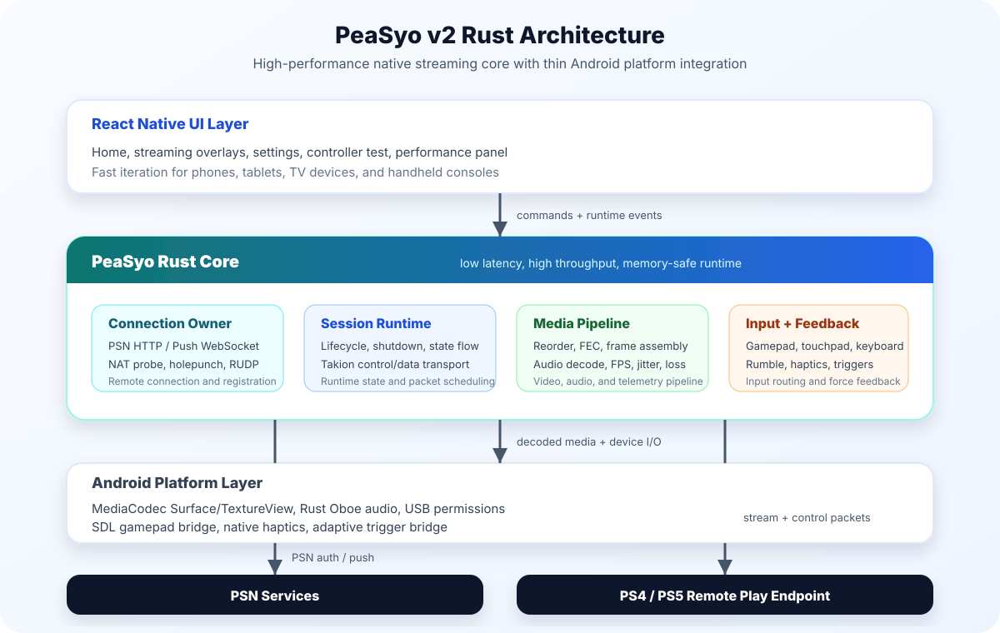

  

  

**English** | [中文](./README.zh_CN.md)

  Next-gen PS4/PS5 high-performance streaming client for Android, built with Rust, delivering a secure, high-performance, and stable streaming experience.

## Intro

PeaSyo, also known as Pixiu (named after an ancient Chinese mythical beast), is a PS4/5 streaming app that supports remote wake-up, remote streaming, button mapping, controller vibration, and many other features. You can play PlayStation games on any Android device with PeaSyo.

> DISCLAIMER: PeaSyo is not affiliated with Sony or PlayStation. All rights and trademarks belong to their respective owners.

## Windows/MacOS/Linux(steamOS)

If you are looking for a PS5/4 streaming app for Windows/MacOS/Linux(steamOS), check out the PeaSyo desktop version [PeaSyo4Desk](https://github.com/Geocld/PeaSyo4Desk).

## iOS

`PeaSyo` is now available on the Apple Store, if you like this app, you can support us by purchasing it for the price of a cup of coffee.

## Features

- Multi-console registration
- Local and remote streaming
- Auto remote streaming without gateway configuration
- Auto remote console registration without PIN code
- Up to 1080P (super-resolution for a higher-resolution experience), HDR support
- AMD FidelityFX Super Resolution v1 [FSRv1]
- Button mapping
- Streaming performance overlay
- Quick menu
- Remote wakeup and standby
- DualSense 5 adaptive triggers (requires overriding native Android drivers + OTG wired connection with DualSense 5 controller)
- DualSense 5 native haptic feedback (requires overriding native Android drivers + OTG wired connection with DualSense 5 controller)
- Razer native haptic feedback (not audio-based vibration) — full PS5 haptic feedback without a DualSense controller
- Razer controller (Razer Ultra/V3 series) advanced configuration

## Architecture

PeaSyo v2 is built around a Rust-native streaming core. React Native focuses on the Android user experience, while the Rust core owns the high-throughput networking, session runtime, packet processing, FEC recovery, statistics, audio pipeline, remote connection flow, and controller transport. The Android platform layer stays thin and is responsible for system integration such as MediaCodec rendering surfaces, USB permissions, SDL loading, and device-specific capabilities.

  

This split keeps latency-sensitive work close to native code while preserving a flexible React Native interface for Android phones, tablets, TV devices, and handhelds.

## Wired Controller Usage

Due to limitations in the Android kernel drivers, not all Android devices support controller vibration. If you are using a DualSense 5 controller and want adaptive trigger support, PeaSyo has built-in kernel drivers for Xbox 360, Xbox Series X/S, and DualSense 5 controllers, enabling full vibration and adaptive trigger support when the controller is connected to the Android device via a wired connection. Here is how to use it:

1. PeaSyo - Settings - Controller & Vibration - Override Android Controller Support - Enable
2. Connect the Xbox/DualSense 5 controller to the Android device via a wired connection
3. A USB device access pop-up will appear; click "OK", and PeaSyo will enter built-in controller driver mode

> Note: You must connect the controller before starting a stream, otherwise PeaSyo will not be able to recognize it.
